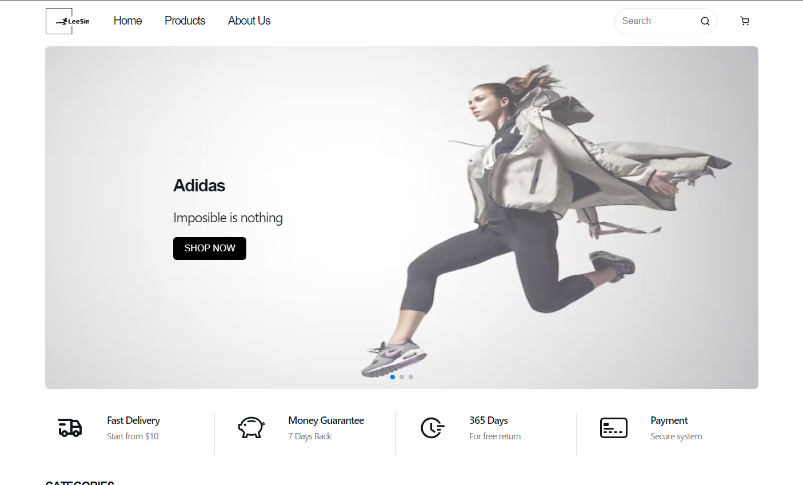
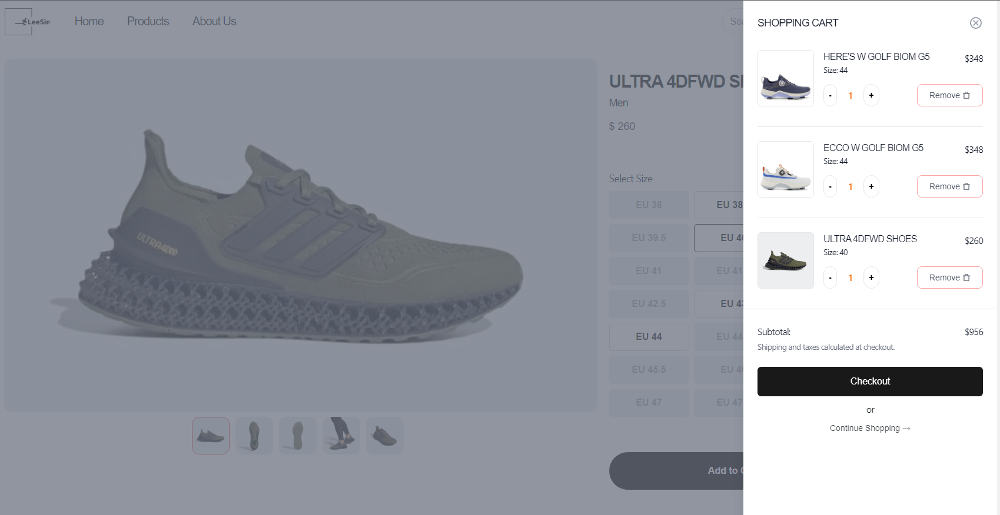
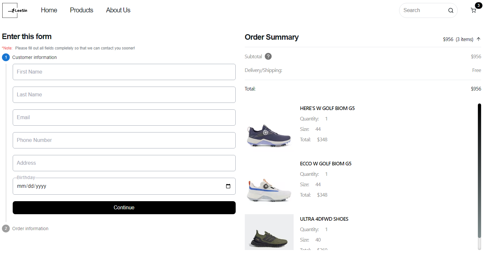
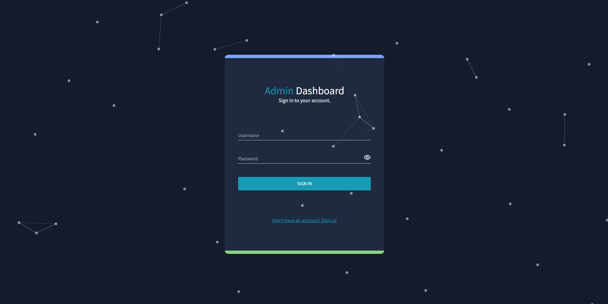
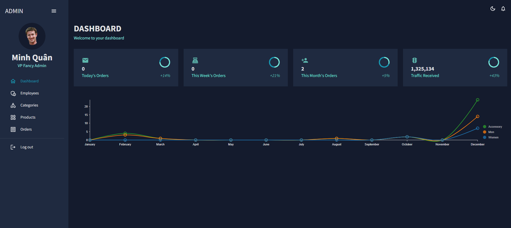
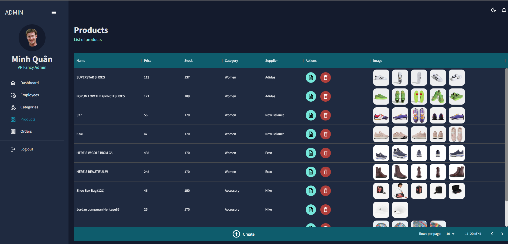

# LS eShop

Welcome to the LS eShop website! This is a simple e-commerce web application built using React.js for admin dashboard,Next.js and Node.js..

## Getting Started

To get started with the LS eShop website, follow these steps:
* As a web-based application, LS Eshop does not require any installation. You can access the application by visiting the website at https://ls-eshop.vercel.app/ in your web browser.

  

## Features
* The LS eShop website has the following features:
* Product browsing: Users can browse products by category or search for specific products using the search bar.

  

* Product details: Users can view detailed information about each product, including price, description, and images.
* Cart: Users can add products to their cart and view the contents of their cart.
* Checkout: Users can complete their purchase by entering their shipping and payment information.

  

# Admin Dashboard
You can access the application by visiting the website at https://ls-eshop-admin.vercel.app/ in your web browser, you will need to log in with a valid username and password. You can create a new user account by registering through the Ecommerce Shop web application.

Once logged in, you can manage the products, orders, and other data of the Ecommerce Shop web application.

  

## Features

Product management: Ability to add, edit, and delete products from the Ecommerce Shop catalog.
* Order management: Ability to view, update, and fulfill orders from customers.
* User management: Ability to manage user accounts, including creating, editing, and deleting user profiles.
* Sales analytics: Ability to view sales data, such as revenue, top-selling products, and sales by date range.
* Multi-language support: Ability to switch the language of the dashboard to better serve users in different regions.
* Role-based access control: Ability to define different levels of access for different user roles, such as admin, editor, and viewer.

  

  

## Contributing
If you would like to contribute to this project, please follow these steps:

1. Fork the repository to your GitHub account.
2. Clone the forked repository to your local machine.
3. Create a new branch for your changes using git checkout -b my-new-feature.
4. Make your changes and commit them using git commit -m "Add some feature".
5. Push your changes to your forked repository using git push origin my-new-feature.
6. Create a pull request to merge your changes back into the main repository.
